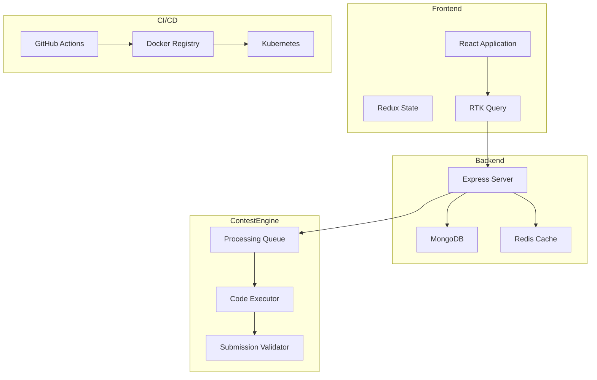
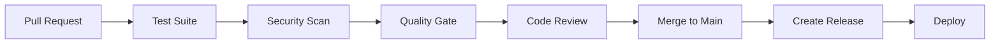

# CodeWar Contest Platform

[](https://github.com/Gokulnath-Saravanan/CampusCodewars/actions/workflows/release.yml)
[](https://github.com/Gokulnath-Saravanan/CampusCodewars/actions/workflows/test.yml)
[](https://github.com/Gokulnath-Saravanan/CampusCodewars/actions/workflows/contest-submission.yml)
[](https://codecov.io/gh/Gokulnath-Saravanan/CampusCodewars)
[](https://sonarcloud.io/summary/new_code?id=username_codewar)

A modern MERN stack contest platform with comprehensive CI/CD implementation for secure and efficient contest management.

## 🏗️ Architecture Overview



## 🚀 Quick Start

### Prerequisites
- Node.js 20.x
- MongoDB 4.4+
- Redis 6+
- Docker & Docker Compose
- Kubernetes (for production)

### Local Development Setup

1. Clone the repository:
```bash
git clone https://github.com/Gokulnath-Saravanan/CampusCodewars.git
cd codewar
```

2. Install dependencies:
```bash
npm install
cd frontend && npm install
cd ../backend && npm install
```

3. Set up environment variables:
```bash
cp .env.example .env
# Edit .env with your configuration
```

4. Start development servers:
```bash
# Terminal 1: Start MongoDB and Redis
docker-compose up -d

# Terminal 2: Start backend
cd backend
npm run dev

# Terminal 3: Start frontend
cd frontend
npm start
```

## 🔄 CI/CD Pipeline

Our CI/CD pipeline ensures code quality and secure deployments:



## 🏆 Contest Management

### Creating a New Contest

1. Create a contest branch:
```bash
git checkout -b contest/my-new-contest
```

2. Use the contest template:
```bash
npm run create-contest
```

3. Follow the validation workflow:
```bash
npm run validate-contest
```

### Contest Structure
```
contests/
├── my-contest/
│   ├── config.json
│   ├── description.md
│   ├── test-cases/
│   │   ├── sample/
│   │   └── hidden/
│   ├── solutions/
│   └── validators/
```

## 🔒 Security Features

- JWT-based authentication
- Rate limiting
- Input validation
- XSS protection
- CSRF protection
- Security headers
- Dependency scanning
- Container security

## 📊 Monitoring & Metrics

Access the monitoring dashboard:
- Development: http://localhost:3000/monitoring
- Production: https://codewar.example.com/monitoring

Key metrics:
- Contest submission success rate
- API response times
- Error rates
- System resource usage
- Security incidents

## 🛠️ Troubleshooting

Common issues and solutions are documented in [TROUBLESHOOTING.md](./docs/TROUBLESHOOTING.md).

For more detailed guides, see:
- [Deployment Guide](./docs/DEPLOYMENT.md)
- [Security Guide](./docs/SECURITY.md)
- [Performance Guide](./docs/PERFORMANCE.md)
- [Contest Guide](./docs/CONTEST.md)

## 📚 Documentation

- [API Documentation](./docs/API.md)
- [Architecture Decision Records](./docs/adr/)
- [Contributing Guide](./CONTRIBUTING.md)
- [Code of Conduct](./CODE_OF_CONDUCT.md)

## 🤝 Contributing

Please read our [Contributing Guide](./CONTRIBUTING.md) before submitting a Pull Request.

## 📄 License

This project is licensed under the MIT License - see the [LICENSE](LICENSE) file for details.